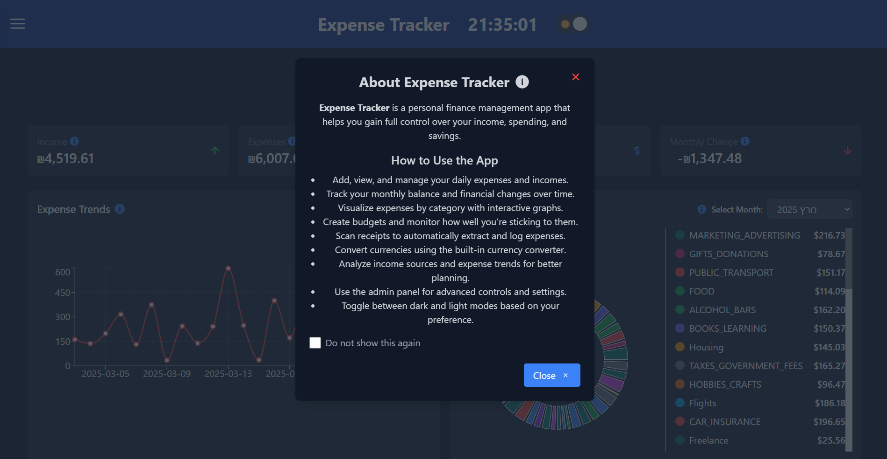

# 💰 Fullstack Expense Tracker App

A fullstack Expense Tracker application built with **NestJS**,**GraphQL** (backend), **React with TypeScript** (frontend), **MongoDB** (database) and JWT(for authentication/role based authorization) It allows users to manage transactions (expenses/income), set budget limits, and automatically extract transaction data from scanned receipts.

Includes a full **admin dashboard** to manage **users, roles, permissions, and app settings**.

## LIVE Deploy In React.ts And NestJS (May take a minute or less to load)


https://backend-expense-tracker-nestjs.onrender.com

## GraphQL Docs (Server Documentation) (May take a minute or less to load)


https://backend-expense-tracker-nestjs.onrender.com/graphql

## Table of Contents

- [Features](#features)
  - [🔐 User Features](#-user-features)
  - [🛠 Admin Features](#-admin-features)
- [Tech Stack](#tech-stack)
- [Getting Started](#getting-started)
- [🚀 Backend Setup (NestJS)](#-backend-setup-nestjs)
- [🔐 Environment Variables](#-environment-variables)
- [💻 Frontend Setup (React)](#-frontend-setup-react)
- [Architecture Design](#architecture-design)
- [Screenshots](#screenshots)
  - [Authentication](#authentication)
    - [Login](#login)
    - [Register](#register)
    - [Forgot Password](#forgot-password)
    - [Reset Password](#reset-password)
  - [Main Content](#main-content)
    - [Dashboard](#dashboard)
    - [Add New Transaction](#add-new-transaction)
    - [Transactions](#transactions)
    - [Edit Transaction](#edit-transaction)
    - [Remove Transaction](#remove-transaction)
    - [Remove ALL Transactions](#remove-all-transactions)
    - [Export Transactions to Excel](#export-transactions-to-excel)
    - [Add Budget](#add-budget)
    - [Budgets](#budgets)
    - [Edit Budget](#edit-budget)
    - [Remove Budget](#remove-budget)
    - [Remove ALL Budgets](#remove-all-budgets)
    - [Scan From Receipt](#scan-from-receipt)
    - [Currency Converter](#currency-converter)
    - [Profile](#profile)
    - [Edit Profile](#edit-profile)
    - [Application Settings](#application-settings)
  - [Admin](#admin)
    - [Admin Dashboard](#admin-dashboard)
    - [Add New User](#add-new-user)
    - [Assign Roles To User](#assign-roles-to-user)
    - [Remove Roles From User](#remove-roles-from-user)
    - [Users Management](#users-management)
    - [Edit User Profile](#edit-user-profile)
    - [Delete User](#delete-user)
    - [Delete ALL Users](#delete-all-users)
    - [Export Users to Excel](#export-users-to-excel)
    - [Roles Management](#roles-management)
    - [Manage User Permissions](#manage-user-permissions)
- [Video demo](#video-demo)

## Features

### 🔐 User Features

- Add, edit, and delete **income** and **expense** transactions
- Set **monthly budget limits** per category
- Upload and **scan receipts** using OCR (Mindee API) to auto-fill transaction data
- View categorized data with **tags**, **dates**, and **payment methods**
- Responsive UI with dark/light mode

### 🛠 Admin Features

- Manage **users**
- Assign and modify **roles** and **permissions**
- Update **application settings**

## Tech Stack

| Layer              | Tech                                                                         | Logo                                                                                                                                                                                                                                                                                                                                                                                                                                                                                                                                                                                                                                                                                                                                                                                           |
| ------------------ | ---------------------------------------------------------------------------- | ---------------------------------------------------------------------------------------------------------------------------------------------------------------------------------------------------------------------------------------------------------------------------------------------------------------------------------------------------------------------------------------------------------------------------------------------------------------------------------------------------------------------------------------------------------------------------------------------------------------------------------------------------------------------------------------------------------------------------------------------------------------------------------------------- |
| Frontend           | React, TypeScript, Tailwind CSS, Redux, React Router DOM, React-icons, Axios |      |
| Backend            | NestJS, TypeScript, Multer, Axios, FormData, GraphQL                         |                                                                                                                                                                                                                                                                                                                                                                                                                                |
| Auth               | JWT (Access Token, Refresh Token)                                            |                                                                                                                                                                                                                                                                                                                                                                                                                                                                                                                                                                                                                                                                                                                                        |
| OCR                | Mindee API                                                                   |                                                                                                                                                                                                                                                                                                                                                                                                                                                                                                                                                                                                                                                                           |
| Currency Converter | Currency Conversion API                                                      |                                                                                                                                                                                                                                                                                                                                                                                                                                                                                                                                                                                                                                                                                |
| Database           | MongoDB, Mongoose                                                            |                                                                                                                                                                                                                                                                                                                                                                                                                                                                                                                                                                                                                                                                                        |
| Dev Tools          | ESLint, Prettier                                                             |                                                                                                                                                                                                                                                                                                                                                                                                                                                                                                                                                                                                                                                                                          |
| DevOps             | Docker, Docker Compose                                                       |                                                                                                                                                                                                                                                                                                                                                                                                                                                                                                                                                                                                                                                                                          |
| Cloud              | Render.com                                                                   |                                                                                                                                                                                                                                                                                                                                                                                                                                                                                                                                                                                                                                                                                |

## Getting Started

### Prerequisites

- Node.js >= 18
- MongoDB
- Mindee API Key (free tier available)
- (Optional) Docker & Docker Compose

## 🚀 Backend Setup (NestJS)

## 🔐 Environment Variables

create .env file at the root of the backend folder with these fields:
<b> PORT=
MONGO_INITDB_ROOT_USERNAME=
MONGO_INITDB_ROOT_PASSWORD=
MONGO_DB_NAME=
MONGO_PORT=
MONGO_HOST=
MONGO_URI=
JWT_SECRET=
JWT_EXPIRES_IN=
JWT_REFRESH_TOKEN_SECRET=
JWT_REFRESH_TOKEN_EXPIRES_IN=
MINDEE_API_KEY= </b>

than:

```bash
cd backend
npm install
npm run start:dev
```

## 💻 Frontend Setup (React)

cd frontend
npm install
npm start

## Architecture Design


## Screenshots

## Authentication

## Login


## Register


## Forgot Password


## Reset Password


## Main Content

# App Info Modal



## Dashboard


## Add New Transaction


## Transactions


## Edit Transaction


## Remove Transaction


## Remove ALL Transactions


## Export Transactions to Excel


## Add Budget


## Budgets


## Edit Budget


## Remove Budget


## Remove ALL Budgets


## Scan From Receipt


## Currency Converter


## Profile


## Edit Profile


## Application Settings


## Admin

## Admin Dashboard


## Add New User


## Assign Roles To User


## Remove Roles From User


## Users Management


## Edit User Profile


## Delete User


## Delete ALL Users


## Export Users to Excel


## Roles Management


## Manage User Permissions


